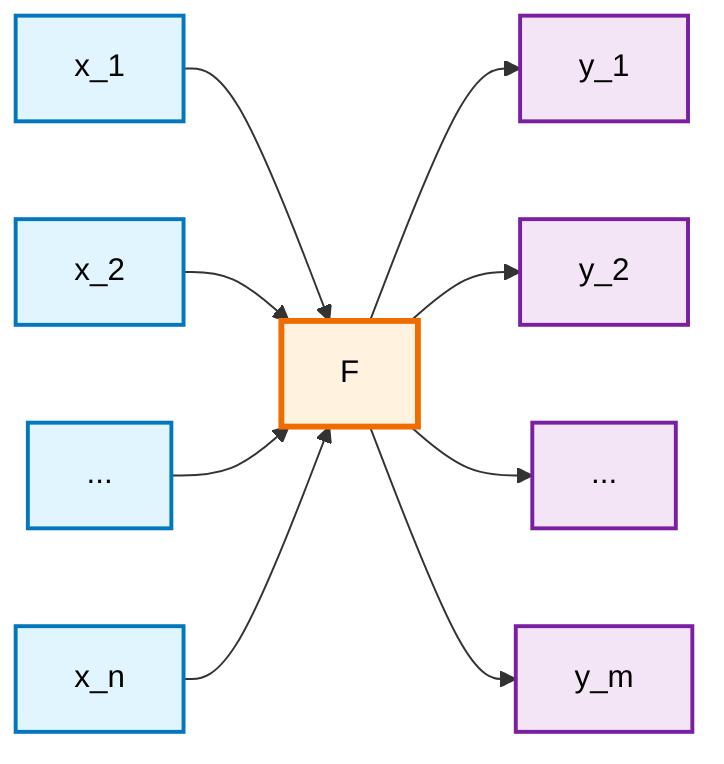
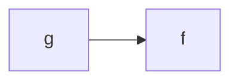

the simplest kind of computing units used to
build artificial neural networks. These computing elements are a generaliza-
tion of the common logic gates used in conventional computing and, since
they operate by comparing their total input with a threshold, this field of
research is known as threshold logic.

# Feed-forward and recurrent networks

 From the view-
point of the engineer, it is important to define how a network should behave,
without having to specify completely all of its parameters, which are to be
found in a learning process. Artificial neural networks are used in many cases
as a black box: a certain input should produce a desired output, but how the
network achieves this result is left to a self-organizing process.

In general we are interested in mapping an n-dimensional real input
(Xl,X2, ... ,Xn) to an m-dimensional real output (Yl,Y2, ... ,Ym). A neural
network thus behaves as a "mapping machine", capable of modeling a func-
tion F : IR n --t IRm. If we look at the structure of the network being used,
some aspects of its dynamics must be defined more precisely. When the func-
tion is evaluated with a network of primitive functions, information flows through the directed edges of the network. Some nodes compute values which
are then transmitted as arguments for new computations. If there are no cy-
cles in the network, the result of the whole computation is well-defined and
we do not have to deal with the task of synchronizing the computing units.

