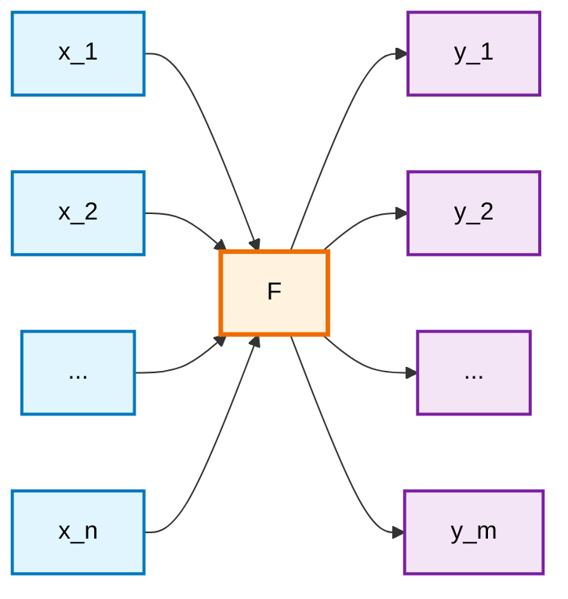
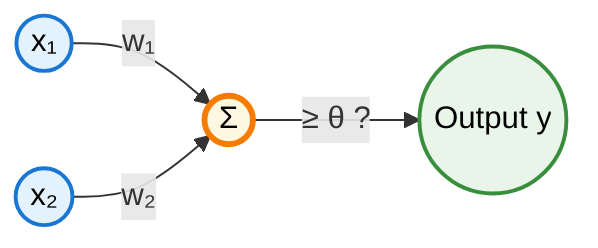
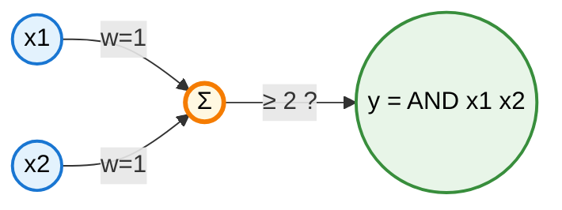
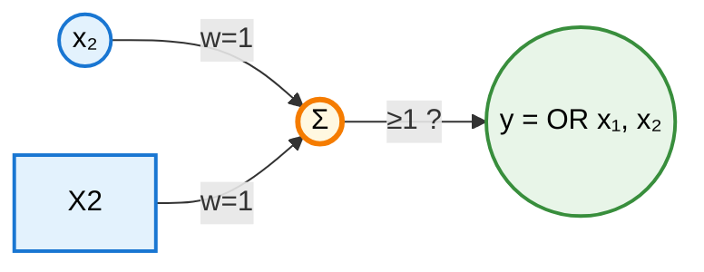

# Historical Development of Neural Networks

## Timeline of Neural Network Evolution

| **Period** | **Year** | **Key Development** | **Contributors** | **Description** | **Impact** |
|------------|----------|-------------------|------------------|-----------------|------------|
| **Early Foundations** | 1943 | McCulloch-Pitts Neuron | Warren McCulloch, Walter Pitts | First mathematical model of artificial neuron using threshold logic | Established theoretical foundation for neural computation |
| | 1949 | Hebbian Learning Rule | Donald Hebb | "Cells that fire together, wire together" - synaptic plasticity principle | Fundamental learning mechanism still used today |
| **First Generation** | 1957 | Perceptron | Frank Rosenblatt | Single-layer neural network with learning algorithm | First trainable neural network, sparked initial AI optimism |
| | 1960 | ADALINE/MADALINE | Bernard Widrow, Marcian Hoff | Adaptive linear neurons with delta rule learning | First practical neural network applications |
| **Winter Period** | 1969 | Perceptron Limitations | Marvin Minsky, Seymour Papert | Proved perceptrons cannot solve XOR problem | Led to first "AI Winter" and reduced research funding |
| | 1970s-1980s | Neural Network Winter | Various | Limited research due to computational constraints and theoretical limitations | Development stagnated, focus shifted to symbolic AI |
| **Revival Era** | 1982 | Hopfield Networks | John Hopfield | Recurrent networks for associative memory and optimization | Renewed interest in neural networks, energy-based models |
| | 1986 | Backpropagation | David Rumelhart, Geoffrey Hinton, Ronald Williams | Efficient algorithm for training multi-layer networks | Solved credit assignment problem, enabled deep networks |
| | 1989 | Convolutional Neural Networks | Yann LeCun | Specialized architecture for image processing | Foundation for modern computer vision |
| **Practical Applications** | 1990s | Support Vector Machines | Vladimir Vapnik | Alternative to neural networks with strong theoretical foundation | Dominated machine learning until deep learning revival |
| | 1997 | LSTM Networks | Sepp Hochreiter, Jürgen Schmidhuber | Recurrent networks that solve vanishing gradient problem | Enabled long-term sequence modeling |
| **Second Winter** | 2000s | Statistical Methods Dominance | Various | SVMs, ensemble methods outperformed neural networks | Neural networks considered outdated |
| **Deep Learning Revolution** | 2006 | Deep Belief Networks | Geoffrey Hinton | Layer-wise pre-training for deep networks | Sparked deep learning revolution |
| | 2009 | GPU Computing | Various | CUDA and GPU acceleration for neural networks | Made large-scale neural network training feasible |
| | 2012 | AlexNet | Alex Krizhevsky, Geoffrey Hinton | Deep CNN wins ImageNet competition by large margin | Demonstrated power of deep learning for computer vision |
| **Modern Era** | 2014 | Generative Adversarial Networks | Ian Goodfellow | Two networks competing to generate realistic data | Revolutionary approach to generative modeling |
| | 2017 | Transformer Architecture | Vaswani et al. (Google) | Attention-based model replacing RNNs for sequences | Foundation for modern NLP (GPT, BERT, ChatGPT) |
| | 2018 | BERT | Google AI | Bidirectional transformer for language understanding | Breakthrough in natural language processing |
| | 2019 | GPT-2 | OpenAI | Large-scale language model showing emergent capabilities | Demonstrated scaling laws for language models |
| **AI Revolution** | 2020 | GPT-3 | OpenAI | 175 billion parameter language model | First model to show human-like text generation |
| | 2021 | AlphaFold 2 | DeepMind | Solved protein folding problem | Revolutionary impact on biology and medicine |
| | 2022 | ChatGPT | OpenAI | Conversational AI based on GPT-3.5 | Brought AI to mainstream public consciousness |
| | 2023 | GPT-4 | OpenAI | Multimodal large language model | Advanced reasoning and multimodal capabilities |
| | 2024 | Mixture of Experts | Various | Efficiently scaling to trillion-parameter models | New paradigm for ultra-large models |

## Key Technological Milestones

### **Mathematical Foundations**

- **1943**: Mathematical formalization of neural computation
- **1949**: First learning rule based on biological principles
- **1986**: Backpropagation algorithm enables deep learning

### **Architectural Innovations**

- **1957**: Single-layer perceptron
- **1982**: Recurrent neural networks with energy functions
- **1989**: Convolutional neural networks for spatial data
- **1997**: LSTM for long-term dependencies
- **2017**: Transformer architecture with attention mechanism

### **Computational Breakthroughs**

- **2009**: GPU acceleration makes large-scale training possible
- **2012**: Deep networks outperform traditional methods
- **2020**: Massive scale models (100B+ parameters)

## Impact on Different Fields

| **Field** | **Before Neural Networks** | **After Neural Networks** | **Key Applications** |
|-----------|----------------------------|----------------------------|---------------------|
| **Computer Vision** | Hand-crafted features, limited accuracy | Human-level performance on many tasks | Image classification, object detection, medical imaging |
| **Natural Language Processing** | Rule-based systems, statistical models | Human-like text understanding and generation | Machine translation, chatbots, content creation |
| **Game Playing** | Programmed strategies, limited domains | Superhuman performance in complex games | Chess, Go, StarCraft, poker |
| **Scientific Computing** | Traditional numerical methods | AI-accelerated discovery | Protein folding, drug discovery, climate modeling |
| **Robotics** | Pre-programmed behaviors | Adaptive, learning-based control | Autonomous vehicles, robotic manipulation |

## Current Trends and Future Directions

### **Emerging Paradigms**

- **Neuromorphic Computing**: Hardware that mimics brain architecture
- **Quantum Neural Networks**: Leveraging quantum mechanics for computation
- **Neural Architecture Search**: AI designing AI architectures
- **Few-Shot Learning**: Learning from minimal examples
- **Continual Learning**: Learning without forgetting previous knowledge

### **Scaling Trends**

- **Model Size**: Exponential growth from millions to trillions of parameters
- **Data Scale**: Training on internet-scale datasets
- **Compute Power**: Specialized AI chips and distributed training
- **Energy Efficiency**: Green AI and efficient architectures

### **Integration Challenges**

- **Interpretability**: Understanding how neural networks make decisions
- **Robustness**: Ensuring reliable performance in real-world conditions
- **Ethics**: Addressing bias, fairness, and societal impact
- **Safety**: Developing AI systems that are beneficial and controllable

---

## Threshold Logic

The simplest kind of computing units used to build artificial neural networks. These computing elements are a generalization of the common logic gates used in conventional computing and, since they operate by comparing their total input with a threshold, this field of research is known as threshold logic.

# Feed-forward and recurrent networks

 From the view-
point of the engineer, it is important to define how a network should behave,
without having to specify completely all of its parameters, which are to be
found in a learning process. Artificial neural networks are used in many cases
as a black box: a certain input should produce a desired output, but how the
network achieves this result is left to a self-organizing process.

In general we are interested in mapping an n-dimensional real input
(Xl,X2, ... ,Xn) to an m-dimensional real output (Yl,Y2, ... ,Ym). A neural
network thus behaves as a "mapping machine", capable of modeling a func-
tion F : IR n --t IRm. If we look at the structure of the network being used,
some aspects of its dynamics must be defined more precisely. When the func-
tion is evaluated with a network of primitive functions, information flows through the directed edges of the network. Some nodes compute values which
are then transmitted as arguments for new computations. If there are no cy-
cles in the network, the result of the whole computation is well-defined and
we do not have to deal with the task of synchronizing the computing units.

## McCulloch–Pitts neuron

$$
y = \begin{cases}
 1 & \text{if } \displaystyle\sum_{i=1}^{n} w_i x_i \geq \theta, \\
 0 & \text{otherwise.}
\end{cases}
$$

Where:

- $x_i$ are the input values
- $w_i$ are the corresponding weights
- $\theta$ is the threshold value
- $y$ is the binary output (0 or 1)

