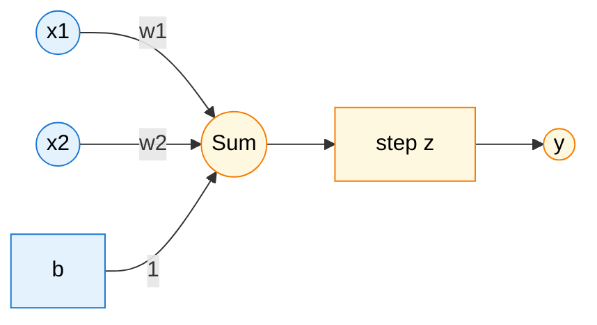

# The Perceptron: A Detailed Introduction

The Perceptron, developed by Frank Rosenblatt in 1958, is one of the earliest and most fundamental algorithms in the history of machine learning. It is a simple binary classifier that serves as the foundational building block for more complex neural networks. Understanding the Perceptron is essential for anyone venturing into the world of AI, as it introduces core concepts like weights, biases, learning rules, and the idea of a decision boundary.

This document provides a detailed, self-explanatory guide to the classical Perceptron, designed for undergraduate and graduate students.

## 1. Definition: The Anatomy of a Perceptron

At its core, the Perceptron is a model that makes a binary decision (yes/no, 1/0, true/false) based on a set of inputs. It was inspired by the biological neuron, which fires an electrical signal only when the total incoming stimuli exceed a certain threshold.

Let's define it mathematically. For an input vector **x** with *n* features, **x** = (x₁, x₂, ..., xₙ), the Perceptron computes a single output *y*. This is done in two steps:

1. **Compute a Weighted Sum:** The model calculates a weighted sum of the inputs, adding a special term called the **bias**. This sum, often called the *net input* or *logit*, is denoted by *z*.

    $$
    z = (w_1 x_1 + w_2 x_2 + \dots + w_n x_n) + b = \mathbf{w} \cdot \mathbf{x} + b
    $$

    - **x** = (x₁, ..., xₙ): The input vector. These are the features of a data point.
    - **w** = (w₁, ..., wₙ): The weight vector. Each weight *wᵢ* represents the importance of the corresponding input *xᵢ*. A large positive weight means that input is strongly excitatory, while a large negative weight means it is strongly inhibitory.
    - *b*: The bias. The bias acts as an offset, making it easier or harder for the neuron to fire. Think of it as a baseline activation level, independent of any input.

2. **Apply an Activation Function:** The output *z* is then passed through an activation function, which in the case of the classical Perceptron is a **Heaviside step function**. This function produces a binary output.

    $$
    y = \phi(z) = \begin{cases} 1 & \text{if } z \ge 0 \\ 0 & \text{if } z < 0 \end{cases}
    $$

    The output *y* is the final classification. The condition `z ≥ 0` is equivalent to setting a threshold. For example, if we set a threshold θ, the neuron fires if **w** · **x** ≥ θ. This is identical to our definition if we set the bias *b* = -θ.

---

### **Funda Corner: The Dot Product**

The heart of the Perceptron's calculation is the dot product, **w** · **x**. What does it mean?

Geometrically, the dot product of two vectors **w** and **x** is related to the projection of one vector onto the other.

$$
\mathbf{w} \cdot \mathbf{x} = \|\mathbf{w}\| \|\mathbf{x}\| \cos(\theta)
$$

where θ is the angle between the two vectors.

- If **w** and **x** point in a similar direction (θ < 90°), the dot product is positive.
- If **w** and **x** are perpendicular (θ = 90°), the dot product is zero.
- If **w** and **x** point in opposite directions (θ > 90°), the dot product is negative.

In the Perceptron, the weight vector **w** defines a "preferred direction". The dot product **w** · **x** measures how much the input vector **x** aligns with this preferred direction. The Perceptron classifies an input as '1' if it is sufficiently aligned with **w**.

---

## 2. The Perceptron Learning Rule

How does the Perceptron "learn"? It learns by adjusting its weights **w** and bias *b* based on the errors it makes on a set of labeled training examples. The goal is to find a **w** and *b* that correctly classify all the training data.

For a given training example (**x**, *t*), where *t* is the true target label (0 or 1), the learning process is as follows:

1. **Compute the output:** Calculate the Perceptron's output *y* for the input **x**.
    `y = φ(w · x + b)`
2. **Calculate the error:** The error ε is the difference between the target and the output.
    `ε = t - y`
3. **Update the weights and bias:** If there is an error (ε ≠ 0), the weights and bias are updated using the Perceptron learning rule. The update rule is applied for each misclassified input within the current epoch:

    $$
    w_i(\text{new}) = w_i(\text{old}) + \eta \cdot \epsilon \cdot x_i
    $$
    $$
    b(\text{new}) = b(\text{old}) + \eta \cdot \epsilon
    $$

    - **η (eta)** is the **learning rate**, a small positive number (e.g., 0.1) that controls the step size of the updates.
    - These updates are applied immediately for each training example that is misclassified during the epoch.

    $$
    w_i(\text{new}) = w_i(\text{old}) + \eta \cdot \epsilon \cdot x_i
    $$
    $$
    b(\text{new}) = b(\text{old}) + \eta \cdot \epsilon
    $$

    - **η (eta)** is the **learning rate**, a small positive number (e.g., 0.1) that controls the step size of the updates.

Let's analyze the update logic:

- **If the classification is correct (y = t):**
    The error `ε = t - y` is 0. The weights and bias are not changed. The model is rewarded for being right by being left alone.

- **If it's a False Negative (t = 1, y = 0):**
    The error `ε = 1 - 0 = 1`. The update becomes:
    `w_new = w_old + η * x`
    `b_new = b_old + η`
    This update "pushes" the weight vector **w** closer to the direction of **x**. The next time this input **x** is seen, the dot product **w** · **x** will be larger, making it more likely for the sum *z* to be positive and for the output to be 1.

- **If it's a False Positive (t = 0, y = 1):**
    The error `ε = 0 - 1 = -1`. The update becomes:
    `w_new = w_old - η * x`
    `b_new = b_old - η`
    This update "pushes" the weight vector **w** away from the direction of **x**. The next time this input **x** is seen, the dot product **w** · **x** will be smaller, making it more likely for the sum *z* to be negative and for the output to be 0.

## Vectorisation of Perceptron Learning Rule: A Matrix-Based Example

To see how vectorization works in practice, let's walk through the process using a full matrix-based approach for the AND function. Instead of updating the weights after each individual sample, this method calculates the updates for all samples in the dataset (a "batch") and then applies a single, consolidated update at the end of the epoch. This is often called the "Batch Perceptron" algorithm.

Let's use the AND function dataset. We'll use the bias trick, so we add a column of 1s to our input data.

**1. Define the Matrices**

- **Input Matrix `X` (augmented):** Each row is a data sample `(1, x₁, x₂)`.
- **Weight Vector `W` (augmented):** A column vector `(b, w₁, w₂)^T`.
- **Target Vector `T`:** A column vector with the true labels.

$
X = \begin{pmatrix}
1 & 0 & 0 \\
1 & 0 & 1 \\
1 & 1 & 0 \\
1 & 1 & 1
\end{pmatrix}
\quad
T = \begin{pmatrix}
0 \\
0 \\
0 \\
1
\end{pmatrix}
$

Let's initialize the weight vector `W` to zeros and use a learning rate `η = 0.1`.

$
W_0 = \begin{pmatrix}
0 \\
0 \\
0
\end{pmatrix}
$

**Epoch 1: Mathematical Flow**

**Step 1: Compute Net Input `Z`**
We calculate the net input for all samples at once by multiplying the input matrix `X` by the weight vector `W`.

$
Z = X \cdot W_0 =
\begin{pmatrix}
1 & 0 & 0 \\
1 & 0 & 1 \\
1 & 1 & 0 \\
1 & 1 & 1
\end{pmatrix}
$

$
\begin{pmatrix}
0 \\
0 \\
0
\end{pmatrix}
=

\begin{pmatrix}
(1 \cdot 0) + (0 \cdot 0) + (0 \cdot 0) \\
(1 \cdot 0) + (0 \cdot 0) + (1 \cdot 0) \\
(1 \cdot 0) + (1 \cdot 0) + (0 \cdot 0) \\
(1 \cdot 0) + (1 \cdot 0) + (1 \cdot 0)
\end{pmatrix}
=

\begin{pmatrix}
0 \\
0 \\
0 \\
0
\end{pmatrix}
$

**Step 2: Apply Activation Function to get Output `Y`**
We apply the Heaviside step function (`φ`) to each element in `Z`. (`φ(z) = 1` if `z ≥ 0`, else `0`).

$
Y = \phi(Z) = \phi \begin{pmatrix}
0 \\
0 \\
0 \\
0
\end{pmatrix}
=

\begin{pmatrix}
1 \\
1 \\
1 \\
1
\end{pmatrix}
$

**Step 3: Calculate the Error Vector `E`**
We find the error by subtracting the predicted output `Y` from the target `T`.

$
E = T - Y =
\begin{pmatrix}
0 \\
0 \\
0 \\
1
\end{pmatrix}
-

\begin{pmatrix}
1 \\
1 \\
1 \\
1
\end{pmatrix}
=

\begin{pmatrix}
-1 \\
-1 \\
-1 \\
0
\end{pmatrix}
$
We have three misclassifications.

**Step 4: Calculate the Total Weight Update `ΔW`**
The update for each weight is the sum of `η * error * input` across all samples. This can be calculated efficiently by multiplying the transpose of the input matrix `X` with the error vector `E`.

$
\Delta W = \eta \cdot (X^T \cdot E) = 0.1 \cdot
\begin{pmatrix}
1 & 1 & 1 & 1 \\
0 & 0 & 1 & 1 \\
0 & 1 & 0 & 1
\end{pmatrix}
\begin{pmatrix}
-1 \\
-1 \\
-1 \\
0
\end{pmatrix}
$

$
\Delta W = 0.1 \cdot
\begin{pmatrix}
(1 \cdot -1) + (1 \cdot -1) + (1 \cdot -1) + (1 \cdot 0) \\
(0 \cdot -1) + (0 \cdot -1) + (1 \cdot -1) + (1 \cdot 0) \\
(0 \cdot -1) + (1 \cdot -1) + (0 \cdot -1) + (1 \cdot 0)
\end{pmatrix}
= 0.1 \cdot
\begin{pmatrix}
-3 \\
-1 \\
-1
\end{pmatrix}
=

\begin{pmatrix}
-0.3 \\
-0.1 \\
-0.1
\end{pmatrix}
$

**Step 5: Update the Weight Vector `W`**
Finally, we add the calculated update `ΔW` to our original weight vector `W_0`.

$
W_1 = W_0 + \Delta W =
\begin{pmatrix}
0 \\
0 \\
0
\end{pmatrix}
+
\begin{pmatrix}
-0.3 \\
-0.1 \\
-0.1
\end{pmatrix}
=

\begin{pmatrix}
-0.3 \\
-0.1 \\
-0.1
\end{pmatrix}
$

After the first epoch, our new weight vector is `W₁ = (-0.3, -0.1, -0.1)^T`. The algorithm would then proceed to Epoch 2 with this new weight vector and repeat the steps until the error vector `E` becomes all zeros.

---

## 3. Geometric Interpretation: Lines, Planes, and Separability

The true power of the Perceptron becomes clear when we visualize it geometrically.

### Input Space

The **input space** (or data space) is the n-dimensional space where our data points live. For a 2D dataset, this is simply a 2D plane. Each input vector **x** is a point in this space.

The Perceptron's decision is based on the sign of `z = w · x + b`. The line (or, in higher dimensions, the **hyperplane**) where this value is exactly zero is the **decision boundary**.

$$
\mathbf{w} \cdot \mathbf{x} + b = 0
$$

This is a linear equation, which always defines a hyperplane. This hyperplane divides the input space into two half-spaces:

- The region where `w · x + b ≥ 0` (classified as 1).
- The region where `w · x + b < 0` (classified as 0).

<!--  -->

The weight vector **w** is always **normal (perpendicular)** to the decision boundary and points into the positive region (the region for class 1). The bias *b* determines the position of the hyperplane, shifting it away from the origin.

---

### **Funda Corner: The Bias Trick**

The bias term *b* can be cumbersome to handle separately. We can simplify the math by incorporating it into the weight vector. This is done by adding a dummy input feature, *x₀*, which is always set to 1.

- Augment the input vector: **x'** = (1, x₁, x₂, ..., xₙ)
- Augment the weight vector: **w'** = (b, w₁, w₂, ..., wₙ)

Now, the net input calculation becomes a single dot product:

$$
z = w_1 x_1 + \dots + w_n x_n + b = w'_0 x'_0 + w'_1 x'_1 + \dots + w'_n x'_n = \mathbf{w'} \cdot \mathbf{x'}
$$

With this trick, the decision boundary is simply `w' · x' = 0`, a hyperplane that passes through the origin of the new (n+1)-dimensional space. This simplifies both the notation and the implementation.

---

### Linear Separability

A dataset is called **linearly separable** if there exists a hyperplane that can perfectly separate the data points of the two classes. The **Perceptron Convergence Theorem** states that if a training dataset is linearly separable, the Perceptron learning algorithm is **guaranteed** to find a separating hyperplane in a finite number of steps.

However, if the data is **not** linearly separable, the Perceptron algorithm will never converge. The weights will continue to be updated indefinitely as it fails to correctly classify all points. The classic example of a non-linearly separable problem is the **XOR** function.

## 4. Worked Example: Learning the AND Function

Let's train a Perceptron to learn the logical AND function. The data is:

| x₁ | x₂ | t (Target) |
|----|----|------------|
| 0  | 0  | 0          |
| 0  | 1  | 0          |
| 1  | 0  | 0          |
| 1  | 1  | 1          |

This dataset is linearly separable. Let's initialize **w** = (0, 0), b = 0, and use a learning rate η = 0.1. We will use the bias trick, so **w'** = (b, w₁, w₂) = (0, 0, 0) and **x'** = (1, x₁, x₂).

**Epoch 1:**

1. **Input x = (0, 0), t = 0:**
    - x' = (1, 0, 0)
    - z = w' · x' = (0,0,0) · (1,0,0) = 0.
    - y = φ(0) = 1. **Misclassification!** (Target is 0).
    - ε = t - y = 0 - 1 = -1.
    - w'(new) = w'(old) + η *ε* x' = (0,0,0) + 0.1 *(-1)* (1,0,0) = **(-0.1, 0, 0)**.

2. **Input x = (0, 1), t = 0:**
    - x' = (1, 0, 1)
    - z = w' · x' = (-0.1, 0, 0) · (1,0,1) = -0.1.
    - y = φ(-0.1) = 0. **Correct.** No update.

3. **Input x = (1, 0), t = 0:**
    - x' = (1, 1, 0)
    - z = w' · x' = (-0.1, 0, 0) · (1,1,0) = -0.1.
    - y = φ(-0.1) = 0. **Correct.** No update.

4. **Input x = (1, 1), t = 1:**
    - x' = (1, 1, 1)
    - z = w' · x' = (-0.1, 0, 0) · (1,1,1) = -0.1.
    - y = φ(-0.1) = 0. **Misclassification!** (Target is 1).
    - ε = t - y = 1 - 0 = 1.
    - w'(new) = (-0.1, 0, 0) + 0.1 *(1)* (1,1,1) = **(0, 0.1, 0.1)**.

After one epoch, our weight vector is **w'** = (0, 0.1, 0.1). The algorithm would continue for more epochs until no misclassifications occur in a full pass. A possible solution it might find is w₁=0.2, w₂=0.2, b=-0.3. The decision boundary `0.2x₁ + 0.2x₂ - 0.3 = 0` correctly separates the AND data.

## 5. Pseudocode

Here is a simple pseudocode for training a Perceptron using the vectorized approach.

```text
// Initialize augmented weight vector (w' = [b, w1, w2, ...])
initialize w_augmented

set learning_rate η

// Loop for a fixed number of epochs or until convergence
for epoch = 1 to max_epochs:
  num_errors = 0
  // Iterate over each training example
  for each (x, t) in training_set:
    // Augment input vector (x' = [1, x1, x2, ...])
    x_augmented = augment(x)

    // Make a prediction
    z = dot_product(w_augmented, x_augmented)
    y = step(z) // step(z) is 1 if z >= 0, else 0

    // If the prediction is wrong, update weights
    if y != t:
      num_errors = num_errors + 1
      error = t - y
      // Vectorized update
      w_augmented = w_augmented + η * error * x_augmented

  // If no errors were made in a full epoch, the model has converged
  if num_errors == 0:
    break
```

## 6. Remarks and Extensions

- **Limitations:** The Perceptron's greatest weakness is that it can only solve linearly separable problems. As shown by Minsky and Papert in their 1969 book "Perceptrons", it famously cannot solve the XOR problem.
- **Modern Successors:** The Perceptron laid the groundwork for modern neural networks. By replacing the hard-threshold step function with smooth, differentiable activation functions (like the Sigmoid, Tanh, or ReLU), we can use gradient-based optimization methods like **backpropagation**.
- **Multi-Layer Networks:** Stacking layers of these "neurons" creates a Multi-Layer Perceptron (MLP), which can learn complex, non-linear decision boundaries and solve problems like XOR.

## 7. Diagram (Mermaid)

This diagram shows the flow of information in a Perceptron with two inputs.



## Coding Example

**Determine the weights of a network with 4 input and 2 output
units using Perceptron learning law**

Input:
$
\begin{pmatrix}
1100 & 1001 & 0011 & 0110
\end{pmatrix}
$

Output:
$
\begin{pmatrix}
11 & 10 & 01 & 00
\end{pmatrix}
$
